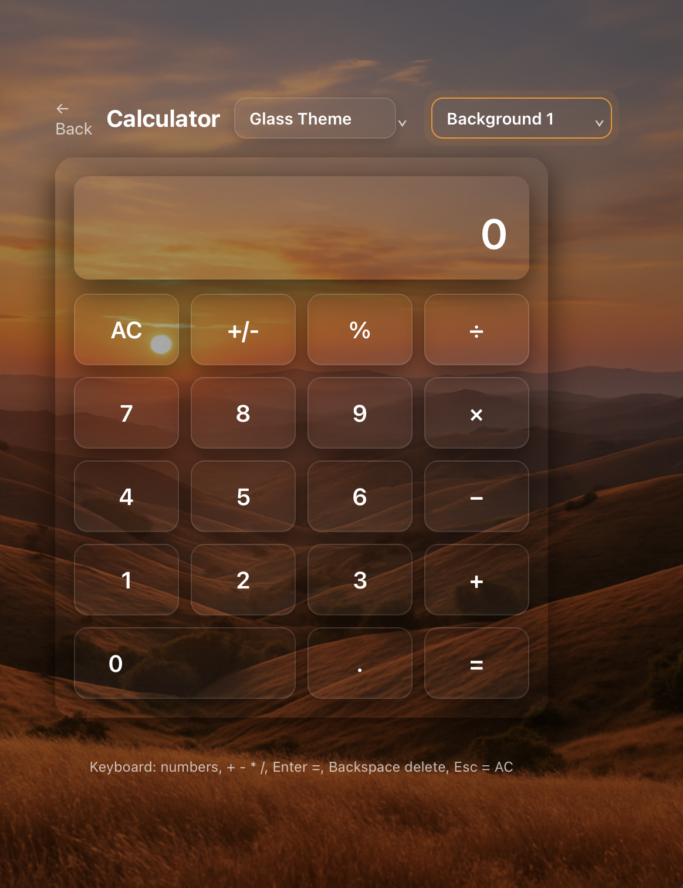

# 🔢 Assignment 4 — JavaScript Calculator

A fully responsive and interactive calculator built using HTML, CSS, and JavaScript.  
It supports arithmetic operations, keyboard input, themes, background switching, and error handling.

### 🔗 Live Demo  
👉👉 https://quynhdinhhp.github.io/CSC317/assignments/4/calculator.html

### 🖼 Preview

